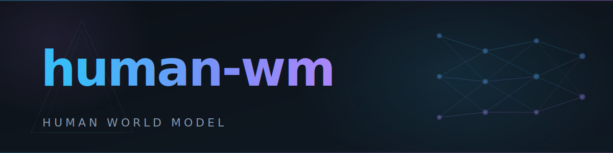

<p align="center">
  
</p>

<p align="center">
  <a href="https://python.org"></a>
  <a href="https://jupyter.org"></a>
  <a href="https://ml-explore.github.io/mlx/build/html/index.html"></a>
  <a href="https://hydra.cc/"></a>
  <a href="https://wandb.ai"></a>
  <a href="LICENSE"></a>
  <a href=""></a>
</p>

<p align="center">
  <b>VRAE-based Human Behavior World Model</b><br>
  A theory layer for modeling human decision dynamics from sparse health data — backbone for <a href="https://github.com/neomakes/neopip">NeoPIP</a>.
</p>

<p align="center">
  <a href="README.ko.md">한국어</a>
</p>

---

## What is human-wm?

**human-wm** is a **theory layer** in the NeoMakes research stack — alongside [eigen-llm](https://github.com/neomakes/eigenllm) (LLM decomposition) and [neural-field](https://github.com/neomakes/neural-field) (continuous-time neural fields). While eigen-llm decomposes large models and neural-field explores oscillatory computation, human-wm models **how humans make decisions** under uncertainty using sparse behavioral data.

It serves as the **ML backbone** for [NeoPIP](https://github.com/neomakes/neopip) (Personal Intelligence Platform), providing the generative model that powers personalized wellness intelligence.

---

## Table of Contents

- [Background & Motivation](#background--motivation)
- [Key Features](#key-features)
- [Architecture](#architecture)
- [Installation](#installation)
- [Usage](#usage)
- [Configuration](#configuration)
- [Project Structure](#project-structure)
- [Theory Layer Ecosystem](#theory-layer-ecosystem)
- [Current Status](#current-status)
- [Roadmap](#roadmap)
- [Contributing](#contributing)
- [License](#license)

---

## Background & Motivation

Health and wellness data is inherently **sparse** — users don't log every meal, workout, or mood change. Traditional models struggle with this irregularity. human-wm addresses this with a **Variational Recurrent Autoencoder (VRAE)** that learns decision dynamics from incomplete data.

The core insight: human behavior can be decomposed into three latent factors:
- **Initial state diversity** (z_a) — baseline individual characteristics
- **Behavioral style** (z_b) — active vs. sedentary tendencies
- **Physiological response** (z_c) — how the body reacts to actions

By sampling combinations of these factors (5 x 5 x 5 = **125 diverse trajectories**), the model generates a spectrum of plausible behavioral futures from the same starting conditions.

This approach draws on heritage from BT-based multi-robot control research — modeling agent decision-making under uncertainty.

---

## Key Features

- **3-Latent VRAE** — Three independent latent variables (z_a: 16D, z_b: 32D, z_c: 32D) capture distinct behavioral dimensions
- **Masking-Based Loss** — Handles sparse/missing data by computing losses only on valid timesteps (63% valid, 37% missing in training data)
- **Policy Network** — Learns `pi(action | state, context; z_b)`: predicts what action a user takes given their state
- **Transition Network** — Learns `tau(next_state | state, action, context; z_c)`: predicts how state changes after an action
- **Autoregressive Rollout** — Chains policy + transition networks to generate full trajectories at inference time
- **4 Distance Metrics** — RMSE, MAE, MAPE, Huber (default) — selectable via config
- **Hydra Configuration** — All hyperparameters controllable via YAML + CLI overrides
- **W&B Integration** — Experiment tracking with loss curves, hyperparameter logging

---

## Architecture

```
Input: [actions(7D), states(2D), context(1D), mask(1D)] x T timesteps

Step 1: Encoder (BiGRU + Masked Attention Pooling)
  → mu_a, sigma_a, mu_b, sigma_b, mu_c, sigma_c

Step 2: Sampling (Reparameterization Trick)
  z_a ~ N(mu_a, sigma_a)  [K=5 samples]  — initial state diversity
  z_b ~ N(mu_b, sigma_b)  [K=5 samples]  — behavioral style
  z_c ~ N(mu_c, sigma_c)  [K=5 samples]  — physiological response
  → 5 x 5 x 5 = 125 combinations

Step 3: Decoder (BiGRU)
  [z_a, z_b, z_c, context] → reconstructed actions + states

Step 4: Policy Network (MLP)
  pi(a_t | s_t, w_t; z_b) → predicted action

Step 5: Transition Network (MLP)
  tau(s_{t+1} | s_t, a_t, w_t; z_c) → predicted next state

Step 6: Rollout (Inference only)
  Chain policy + transition autoregressively → 125 future trajectories
```

### Loss Function

```
L_total = w_vae * L_VAE + w_action * L_action + w_transition * L_transition + w_rollout * L_rollout

Where:
  L_VAE       = L_reconstruction + beta * L_KL  (with KL annealing: 0 → 1)
  L_action    = masked distance(predicted_action, true_action)
  L_transition = masked distance(predicted_state, true_state)
  L_rollout   = mean distance across 125 generated trajectories
```

### Data Schema (10 features per timestep)

| Category | Features | Dimensions |
|:--|:--|:--|
| Actions | sleep_hours, workout_type, location, steps, calories, distance, active_minutes | 7D |
| States | heart_rate_avg, mood | 2D |
| Context | weather_conditions | 1D |
| Mask | valid/missing indicator | 1D |

---

## Installation

### Prerequisites

- Python 3.10+
- Apple Silicon Mac recommended (MLX is optimized for Apple GPUs)

### Setup

```bash
git clone https://github.com/neomakes/human-wm.git
cd human-wm
pip install mlx hydra-core wandb numpy tqdm pandas
```

---

## Usage

### Quick Test (1 epoch)

```bash
python scripts/train.py training.epochs=1 training.batch_size=32
```

### Full Training

```bash
python scripts/train.py \
  training.epochs=100 \
  training.batch_size=32 \
  training.learning_rate=0.001 \
  model.hidden_dim=256
```

### With W&B Tracking

```bash
wandb login
python scripts/train.py \
  training.use_wandb=true \
  wandb.project="human-wm-vrae" \
  training.epochs=100
```

### Sequential Experiments

Run multiple configurations automatically with early stopping:

```bash
python scripts/run_experiments.py

# Or in background
nohup python scripts/run_experiments.py > logs/experiments.log 2>&1 &
```

### Inference & Visualization

Use `analysis.ipynb` to:
- Extract latent variable distributions for specific users
- Visualize user clusters with t-SNE
- Generate and compare 125 trajectory scenarios

---

## Configuration

All hyperparameters are managed via Hydra. Override any setting from the CLI.

### Model (`conf/model/vrae.yaml`)

| Parameter | Default | Description |
|:--|:--|:--|
| `hidden_dim` | 64 | RNN hidden dimension |
| `num_layers` | 2 | RNN layer count |
| `latent_action_dim` | 16 | z_a dimension |
| `latent_behavior_dim` | 32 | z_b dimension |
| `latent_context_dim` | 32 | z_c dimension |
| `k_a`, `k_b`, `k_c` | 5 | Samples per latent variable |
| `distance_type` | huber | Distance metric (rmse/mae/mape/huber) |

### Training (`conf/training/default.yaml`)

| Parameter | Default | Description |
|:--|:--|:--|
| `learning_rate` | 0.001 | Adam learning rate |
| `batch_size` | 32 | Batch size (users) |
| `epochs` | 100 | Training epochs |
| `kl_annealing_end` | 20 | KL weight reaches 1.0 at this epoch |
| `w_vae` | 1.0 | VAE loss weight |
| `w_action` | 0.5 | Policy loss weight |
| `w_transition` | 0.5 | Transition loss weight |
| `w_rollout` | 0.3 | Rollout loss weight |

```bash
# Example: large model with slow KL annealing
python scripts/train.py \
  model.hidden_dim=512 \
  model.latent_behavior_dim=64 \
  training.kl_annealing_end=50 \
  training.learning_rate=0.0005
```

---

## Project Structure

```
human-wm/
├── conf/                        # Hydra configuration
│   ├── config.yaml              # Main config (data paths, W&B)
│   ├── model/
│   │   └── vrae.yaml            # Model hyperparameters
│   └── training/
│       └── default.yaml         # Training hyperparameters
├── models/
│   └── vrae.py                  # VRAE, PolicyNetwork, TransitionNetwork
├── scripts/
│   ├── train.py                 # Training loop with KL annealing
│   ├── run_experiments.py       # Sequential experiment runner
│   └── quick_test.py            # Fast validation run
├── data/
│   └── fitness_tracker_data.npz # Training data (999 users, 1000 timesteps)
├── docs/                        # Design documents and preprocessing notebooks
├── analysis.ipynb               # Inference, visualization, t-SNE analysis
├── logs/                        # Checkpoints and experiment results
├── LICENSE
├── CONTRIBUTING.md
├── CODE_OF_CONDUCT.md
└── README.md
```

---

## Theory Layer Ecosystem

human-wm is one of three **theory layers** in the NeoMakes research stack:

| Layer | Repository | Focus |
|:--|:--|:--|
| **human-wm** | this repo | Human behavior world model — VRAE-based decision dynamics |
| **eigen-llm** | [neomakes/eigenllm](https://github.com/neomakes/eigenllm) | LLM decomposition — Large General AI → Small Special AI |
| **neural-field** | [neomakes/neural-field](https://github.com/neomakes/neural-field) | Continuous-time neural fields — Kuramoto + Free Energy |

### Related Application Layers

- **[NeoPIP](https://github.com/neomakes/neopip)** — Personal Intelligence Platform. human-wm serves as the ML backbone for NeoPIP's wellness intelligence features.
- **[NeoSense](https://github.com/neomakes/neosense)** — Multi-modal sensor logging. Provides raw physical data patterns that inform behavioral modeling.

---

## Current Status

**Research / On Hold** — Model architecture is 100% complete. Training convergence requires further investigation.

### What Works

- Model architecture: all components implemented (VRAE encoder/decoder, policy network, transition network)
- 4 loss functions fully integrated (VAE + policy + transition + rollout)
- NaN issue resolved: log-variance parameterization + clipping stabilized training
- Training runs without errors; loss decreases across epochs

### Known Issue

- **Training convergence**: the model converges but generated trajectories lack expected diversity
- **Suspected cause**: z_b/z_c posterior collapse — the KL term may allow the model to ignore these latent variables
- **Decision**: paused to focus on other priorities; the architectural fundamentals are sound

---

## Roadmap

- [ ] Investigate posterior collapse with KL annealing schedule adjustments
- [ ] Try beta-VAE approach (separate beta weights per latent variable)
- [ ] Add trajectory diversity metrics (coverage, inter-trajectory distance)
- [ ] Quantitative performance evaluation script
- [ ] Real user data integration (from NeoSense pipeline)

---

## Contributing

See [CONTRIBUTING.md](CONTRIBUTING.md) for guidelines.

This project follows the [Code of Conduct](CODE_OF_CONDUCT.md).

---

## License

This project is licensed under the MIT License — see [LICENSE](LICENSE) for details.
